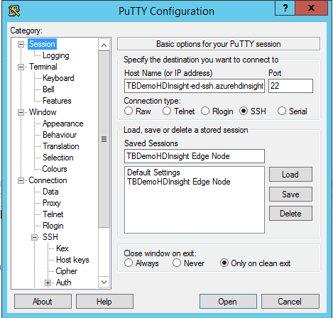
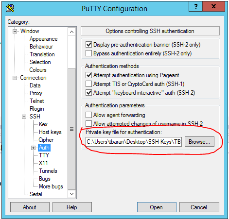

In the Data Science VM, execute the following steps to prepare for the lab

1.	Download Putty [64bit MSI](https://the.earth.li/~sgtatham/putty/latest/w64/putty-64bit-0.68-installer.msi) from their [download page](http://www.chiark.greenend.org.uk/~sgtatham/putty/latest.html)
2.	Install Putty in the default folder and follow steps to complete installation
3.	Copy the SSH-Keys.zip file in your DSVM Desktop and unzip it there.
4.	From Putty test connection to the HDInsight Edge Node, using ssh keys from above. 

Screenshots below

5.	From your DSVM download and install latest MS R Client (3.3.3) from [here](http://aka.ms/rclient/download). If you need to learn more, details are in this [page](https://msdn.microsoft.com/en-us/microsoft-r/r-client-get-started#installrclient).
6.	Open Visual Studio (VS) and sign-in to your account (could be trial account)
7.	In VS, top menu, select R Tools->Data Science Settings, to use the R environment
8.	Copy the R-HDInsight-LocalDirectory.zip file in your DSVM Desktop and unzip it there.
9.	In VS, run the R code from labScript.R

`
###############################################################################
# Create Linear Model and Plot 
# Number of flights by Day of Week & 
# Arrival Delay by Day of Week
###############################################################################
airlineDelayLinearModel <- function (sourceFileSystem, sourceDataDirectory) {
    # Create info list for the airline data
    colInfo <- list(DAY_OF_WEEK = list(type = "factor",
        levels = as.character(1:7),
        newLevels = c("Mon", "Tues", "Wed", "Thur", "Fri", "Sat", "Sun")))
    # Define the text data source
    airDS <- RxTextData(file = sourceDataDirectory, missingValueString = "M",
                        colInfo = colInfo, fileSystem = sourceFileSystem)
    # Fit a regression model and compute average delay by day of week
    system.time(
      arrDelayLinearModel <- rxLinMod(ARR_DELAY ~ DAY_OF_WEEK, data = airDS, 
                                        cube = TRUE)
    )
    countsDF <- rxResultsDF(arrDelayLinearModel)
    # Plot the Number of flights by Day of Week
    rxLinePlot(Counts ~ DAY_OF_WEEK, data = countsDF, 
                            main = "Number of Flights by Day of Week")
    # Plot the Average Arrival Delay by Day of Week
    rxLinePlot(ARR_DELAY ~ DAY_OF_WEEK, data = countsDF, 
                            main = "Average Arrival Delay by Day of Week")
    return(arrDelayLinearModel)
}

###############################################################################
# Create Logistic Regression Model
###############################################################################
airlineDelayLogisticModel <- function (sourceFileSystem, sourceDataDirectory) {
    # Create info list for the airline data
    airlineColInfo <- list(
    DAY_OF_WEEK = list(type = "factor"),
    ORIGIN = list(type = "factor"),
    DEST = list(type = "factor"),
    DEP_TIME = list(type = "integer"),
    ARR_DEL15 = list(type = "logical"))
    # get all the column names
    varNames <- names(airlineColInfo)
    # Define the text data source
    airOnTimeData <- RxTextData(sourceDataDirectory, colInfo = airlineColInfo,
                        varsToKeep = varNames, fileSystem = sourceFileSystem)
    # Formula to use for Logistic Regression
    formula = "ARR_DEL15 ~ ORIGIN + DAY_OF_WEEK + DEP_TIME + DEST"
    # Run a logistic regression Classification model to predict 
    # delayed arrival
    system.time(
        modelPredictFlightDelay <- rxLogit(formula, data = airOnTimeData)
    )
    return (modelPredictFlightDelay)
}

###############################################################################
# Global variables
# csv data files are in the folder below
airOnTimeDataFolderName <- "AirOnTimeCSV2012"
###############################################################################

###############################################################################
# Setup local Compute Context and
# Create models using data from 
# Local Filesystem
###############################################################################
rxSetComputeContext("local")
rxGetComputeContext()
localSourceDataDir <- paste("C:/Users/tbarari/Desktop/R-HDInsight-LocalDirectory", 
                        airOnTimeDataFolderName, sep = "/")
localAirlineDelayLinearModel <- airlineDelayLinearModel("native", localSourceDataDir)
localAirlineDelayLogisticModel <- airlineDelayLogisticModel("native", localSourceDataDir)

###############################################################################
# Setup Compute Context to connect to 
# Remote HDInsight Cluster and
# Create models using data from 
# Remote HDFS
###############################################################################
# User name to login/ssh to Edge Node
mySshUsername <- "sshuser"
# Public facing Cluster IP address for Edge Node
mySshHostname <- "TBDemoHDInsight-ed-ssh.azurehdinsight.net"
# Provide local path to SSH keys, to auithenticate against Edge Node
mySshSwitches <- "-i C:/Users/tbarari/Desktop/SSH-Keys/TBDemoSSHPrivateKey.ppk"
# Common paths in my HDInsight instance
myNodeLocalDirName = "/var/RevoShare"
myHdfsShareDirName = "/user/RevoShare"
# Share directory in Edge Node's local file system
# This directory is shared by all the nodes in the cluster
myNodeShareDir <- paste(myNodeLocalDirName, mySshUsername, sep = "/")
# Share HDFS directory of the HDInsight Cluster
myHdfsShareDir <- paste(myHdfsShareDirName, mySshUsername, sep = "/")
# Default name node settings. Change for HA solution
myNameNode <- "default"
myPort <- 0
# Create the Spark Cluster Compute Context
mySparkCluster <- RxSpark(
  hdfsShareDir = myHdfsShareDir,
  shareDir = myNodeShareDir,
  sshUsername = mySshUsername,
  sshHostname = mySshHostname,
  sshSwitches = mySshSwitches,
  sshProfileScript = '/etc/profile',
  nameNode = myNameNode,
  port = myPort,
  consoleOutput = TRUE
)
# Set the compute context 
rxSetComputeContext(mySparkCluster)
rxGetComputeContext()
# Define the HDFS (WASB) file system
hdfsFS <- RxHdfsFileSystem()
# Set directory in HDFS where your data is
remoteSourceDataDir <- file.path(myHdfsShareDirName, airOnTimeDataFolderName)

localAirlineDelayLinearModel <- airlineDelayLinearModel(hdfsFS, remoteSourceDataDir)
localAirlineDelayLogisticModel <- airlineDelayLogisticModel(hdfsFS, remoteSourceDataDir)

`
