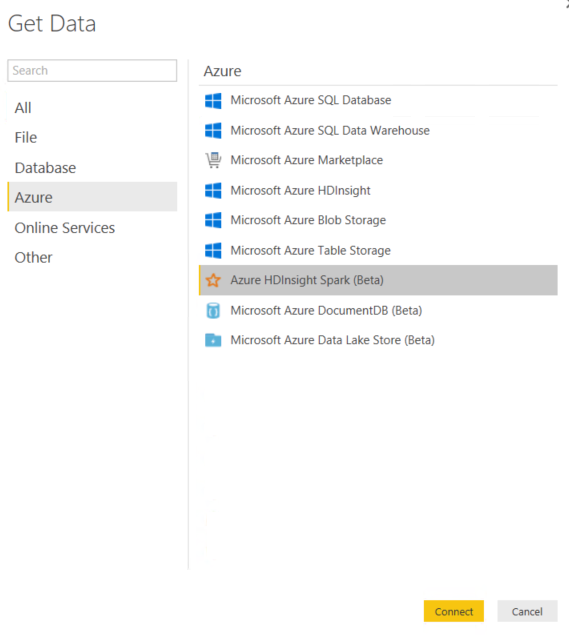
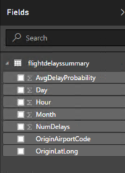
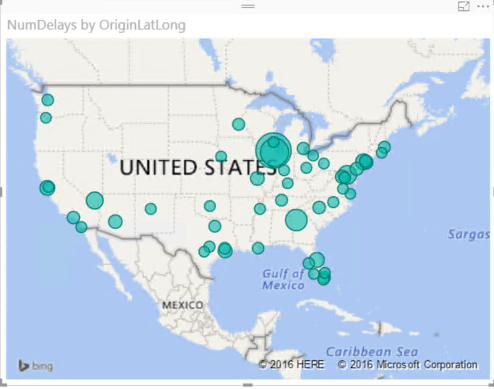
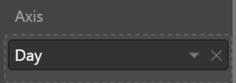
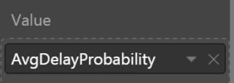
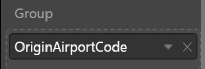
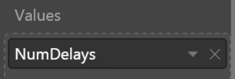
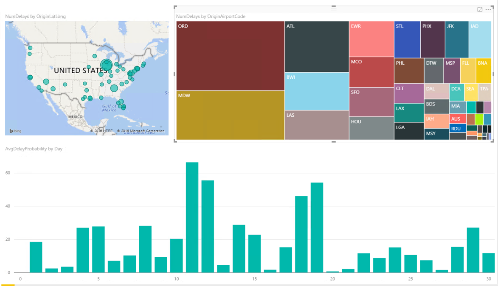

# Exercise 2: Visualizing in Power BI Desktop

Duration: 20 mins

Synopsis: In this exercise, attendees will construct a report in Power BI Desktop Client that uses the map visualization to illustrate the predicted delays, using the data originally scored using Machine Learning, but summarized in a table using Spark on HDInsight.

* [Task 1: Connect to the HDInsight Spark Using Power BI Desktop](##task-2-connect-to-the-hdinsight-spark-using-power-bi-desktop)
* [Task 2: Create Power BI Report](##task-3-create-power-bi-report)

# Task 1: Connect to the HDInsight Spark Using Power BI Desktop

1. Downlaod the latest version of Power BI Desktop [HERE](https://powerbi.microsoft.com/en-us/desktop/). Launch Power BI Desktop.

2. Click on **Get Data** from the left side of the welcome window.

    

1. Click on the **Azure** from the left and select **Azure HDInsight Spark (Beta)** from the new **Get Data** window. Click on the **Connect** button on the bottom right corner.

    

1. Click **Continue** on the bottom right corner of the new window.
2. Connect to this Spark Cluster: `https://lmaspark.azurehdinsight.net`
3. Click the **OK** button.
4. When prompted, enter the cluster user name and password and then click **Connect**.
   - User name: **cortana**
   - Password: **Password.1!!**

2. When the dialog box disappears, look for the **flightdelaysummary** in the list and check the box next to it.

    

2. Click on the **Load** button from the bottom right corner of the window. It will take couple of minutes to load the data into the Power BI Desktop client.

# Task 2: Create Power BI Report

1. Once the data load is completed, you will find the **flightdelaysummary** to the right side of the screen under the **Fields** area.

    

1. From the **Visualizations** area, which is left to the **Fields** area, click the **Globe** icon to add a Map visualization to the report design surface.

    

1. With the Map visualization still selected, in the **Fields** area at right, expand the tabled called **flightdelayssummary**.

    

1. Click and drag the field labeled **OriginLatLong** and drop it into the **Location** field located just below visualizations.

    

1. Next, drag the field labeled **NumDelays** and drop it into the **Size** field.

    

1. Your map should look something like the following:

    

1. Unselect the Map visual by clicking on the white space on the report page.
2. From the **Visualizations** area, which is left to the **Fields** area, click the **Stacked Column Chart** icon to add a bar chart visualization to the report design surface.

    

1. With the **Stacked Column Chart** visualization still selected, in the Fields area at right, expand the tabled called **flightdelayssummary**.

    

1. Click and drag the field labeled **Day** and drop it into the **Axis** field located just below visualizations.

    

1. Next, drag the field labeled **AvgDelayProbability** and drop it into the **Value** field.

    

1. Grab the corner of the new **Stacked Column Chart** Visual and drag it out by making wide as the bottom of your report design surface.
2. Your report should look something like the following:

    

1. Unselect the Stacked Column Chart visual by clicking on the white space on the report page.
2. From the **Visualizations** area, which is left to the **Fields** area, click the **Treemap** icon to add this visualization to the report design surface.

    

1. With the **Treemap** visualization still selected, in the Fields area at right, expand the tabled called **flightdelayssummary**.

    

1. Click and drag the field labeled **OriginAirportCode** and drop it into the **Group** field located just below visualizations.

    

1. Next, drag the field labeled **NumDelays** and drop it into the **Value** field.

    

1. Grab the corner of the new **Treemap** Visual and drag it out by making wide as the top of your report design surface. Your report should look similar to the following:

    

1. You can cross filter the visualizations on the report by click on the one of the other visuals within the report as shown below.

    

1. You can save this Power BI report by click on Save icon from the top left corner of the screen.

