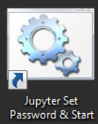

In this exercise we will create a new predictive model in a Jypter Notebook and publish the trained model to the Azure ML web services infrastructure for operationalize.  

# Environment Prep: Creating a Data Science VM
For this exercise we will be using an Azure Data Science VM.  This VM is available in the Azure marketplace and is pre-configured with many open source and MS data science tools.  You will need one deployed to run the rest of this lab.  If you already have one you can use that.  If not, follow the instructions on pages 2 – 10 in the DSVM Walkthrough Manual.

Click here: [DSVM Workshop Walkthrough.pdf manual](https://github.com/chadgr/MLLab/blob/master/ResourceFiles/DSVM%20Workshop%20Walkthrough.pdf) to open the DSVM Manual.  **Please remember to only go through pages 2 - 10 to setup the VM only**

# Exercise 1: Setting up the Jypter Notebook

The DSVM is also a fully configured Jupyter Notebooks Server (Disabled By default for security, you
have to first set up your own password). Please make sure you set up jupyter security after first logon by using the utility on the desktop.

You can then open Jupyter from the desktop or browse to “https//localhost:9999/”

# Exercise 2: Deploying an R predictive model to Azure ML Web Services

For this exercise we will be using an example in the DSVM Overview Document.  This reference guide walks you through the many capabilities of the DSVM.   For this exercise we will be going right to **Page 26** of this document and starting there.  We will end this exercise on **Page 36**.  We encourage you to review the entire document at a later date and review all the other capabilities in the DSVM that we are not covering today.

Click here: [DSVM Workshop Walkthrough.pdf manual](https://github.com/chadgr/MLLab/blob/master/ResourceFiles/DSVM%20Workshop%20Walkthrough.pdf) to open the DSVM Manual.  **Please remember to start on Page 26**
