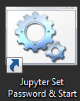
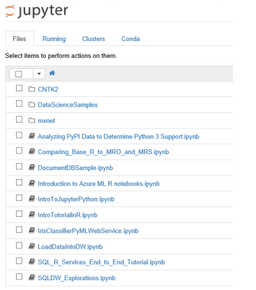

# Exercise 1: Setting up the Jypter Notebook

The DSVM is also a fully configured Jupyter Notebooks Server (Disabled By default for security, you
have to first set up your own password). Please make sure you set up jupyter security after first logon by using the utility on the desktop.

You can then open Jupyter from the desktop or browse to “https//localhost:9999/”

# Exercise 2: Deploying an R predictive model to Azure ML Web Services

For this exercise we will be using an example in the [DSVM Workshop Walkthrough.pdf manual](https://github.com/chadgr/MLLab/blob/master/ResourceFiles/DSVM%20Workshop%20Walkthrough.pdf).  This reference guide walks you through the many capabilities of the DSVM.   For this exercise we will be going right to **Page 26** of this document and starting there.  We will end this exercise on **Page 36**.  We encourage you to review the entire document at a later date and review all the other capabilities in the DSVM that we are not covering today.
